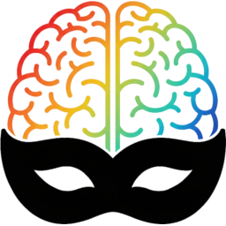

# SMART AI mask builder

SMART (Segmentation Model for ART) is a simple AI mask generator for
images using Segment Anything 2, tailored to masks that can be used
with the ART raw image processor.

## Prerequisites

Make sure you have the following installed:

1. **Python 3**
2. **SAM2**: https://github.com/facebookresearch/sam2
3. **wxPython**: https://wxpython.org
4. **Pillow**: https://pillow.readthedocs.io/
5. **platformdirs**: http://pypi.org/project/platformdirs/

All the dependencies can be installed with PIP, with the command
`pip install -r requirements.txt`.

## License

[GNU GPL](https://www.gnu.org/licenses/gpl-3.0.en.html)

## Setup

Download one of the SAM 2 model checkpoints from
https://github.com/facebookresearch/sam2?tab=readme-ov-file#download-checkpoints,
and put it in the `models/` directory.

Run `python/main.py --init-config` from a terminal to create an
initial configuration file.  The path to the file will be printed in
output.  Edit the file with a text editor, and adapt the `model` and
`device` parameters to your setup, where `model` should be the name of
the SAM2 checkpoint to use, and `device` the device to use for
computations: `"cuda"` for a CUDA-capable GPU, `"mps"` for the GPU on
an ARM Apple machine, or `"cpu"` otherwise (this might be slow though).

## Usage

Build a mask for the image by adding positive and negative points, by
using *shift+left click* and *shift+right click* respectively. The
mask is built on the fly. When you are happy, save the mask.

